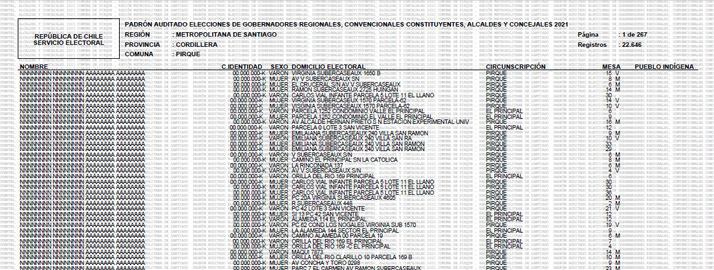
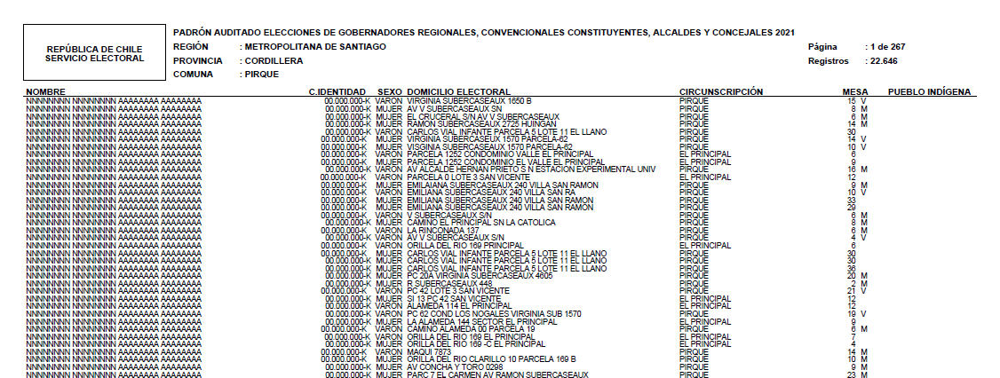
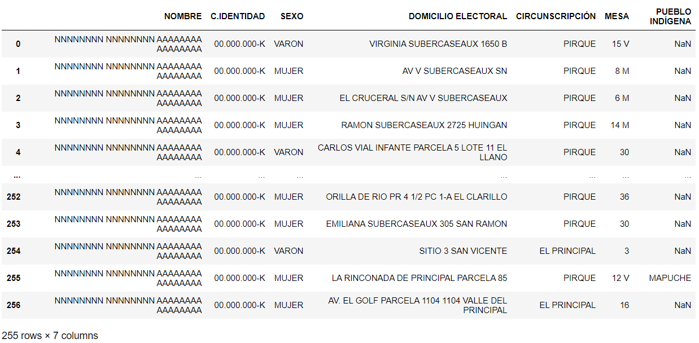

# Water Mark Remover

## Padrón Electoral chileno con PyPDF2 + tabula

Recientemente, SERVEL ha incorporado la siguiente marca de agua en el Padrón Electoral chileno:

La presencia de esta marca de agua, vuelve muy compleja la extracción de la información contenida en el padrón electoral, por lo que realizar análisis sobre estos datos queda supeditado al uso de programas especiales para la extracción de las marcas de agua.

Este cuaderno tiene como objetivo remover esta marca de agua, para eso haremos uso de las librerías: PyPDF2 y pikepdf para el tratamiento de la información contenida en el archivo pdf, y por otra parte tabula y pandas para la extracción de las tablas, almacenaje y la creación de un archivo csv.

Este cuaderno considera la interacción con el usuario, y puede ser empleado en otros contextos distintos al padrón electoral.

Como modelo de juguete, se ha generado un padrón "file_test.pdf" sin nombres reales ni ruts. Pero usted puede acceder al padrón de las elecciones 2021 en el siguiente link: 

`<link>` : <https://www.servel.cl/padron-electoral-definitivo-y-nomina-de-inhabilitados-3>

## Librerías necesarias

### pikepdf
`pip install pikepdf`

pikepdf se emplea para abrir algunos archivos pdf con cierta encriptación no disponible aún en PyPDF2.

### PyPDF2
`pip install PyPDF2`

PyPDF2 se utiliza para abrir los archivos, eliminar la información no deseada y luego escribir un archivo de salida sin marca de agua.

### tqdm
`pip install tqdm`

tqdm ayuda a visualizar los tiempos de cada iteración y el progreso del programa.

### Pandas
`pip install pandas`

pandas es una librería para la manipulación y el análisis de los datos.

### tabula
`pip install tabula`

tabula nos permite extraer las tablas contenidas dentro de archivos .pdf .

## Resultados

El uso de este cuaderno da como resultado un archivo .pdf sin la marca de agua y luce de la siguiente forma:

Finalmente podemos alojar la información del pdf en un data frame .csv .

En construcción...